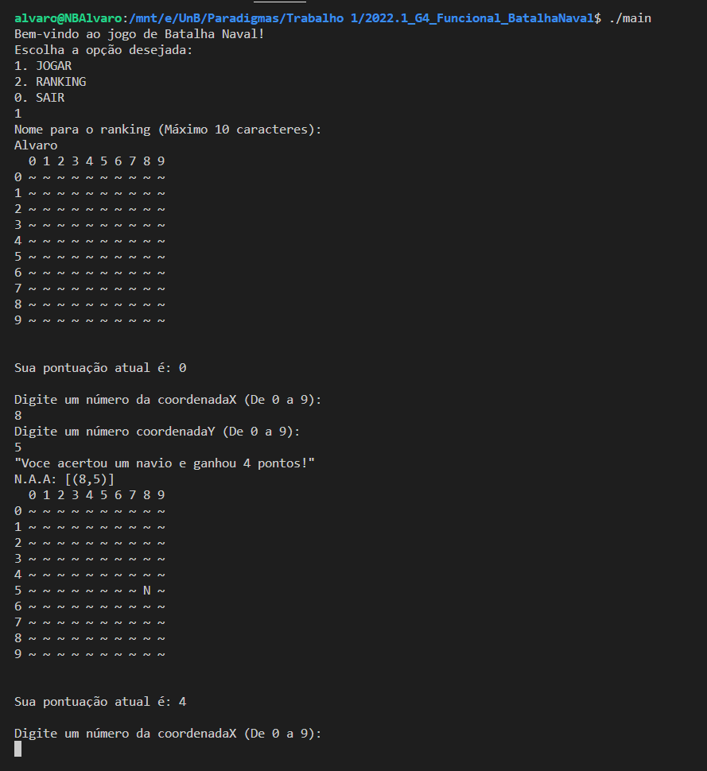
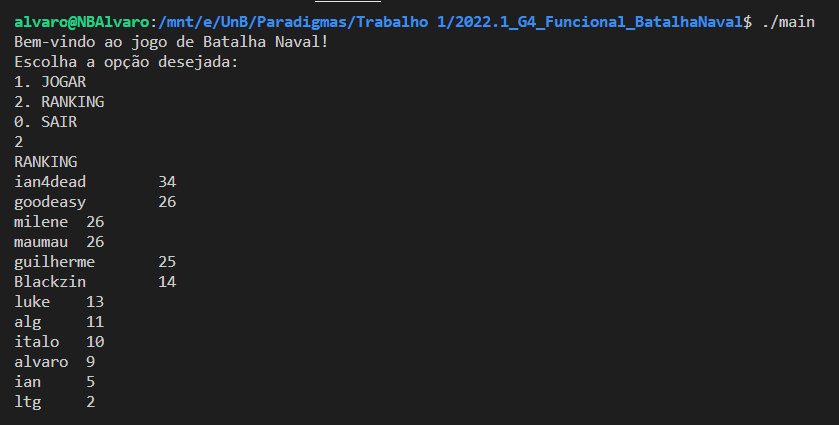

# 2022.1_G4_Funcional_BatalhaNaval

**Disciplina**: FGA0210 - PARADIGMAS DE PROGRAMAÇÃO - T01 <br>
**Nro do Grupo**: 04<br>
**Paradigma**: Funcional<br>

## Alunos
|Matrícula | Aluno |
| -- | -- |
| 18/0096991  |  Álvaro Leles |
| 18/0100831  |  Gabriel Avelino |
| 18/0145088  |  Gabriel Bonifácio |
| 18/0101617  |  Guilherme de Morais |
| 18/0102087  |  Ian Fillipe |
| 18/0113666  |  Ítalo Guimarães |
| 18/0102656  |  Ítalo Vinicius |
| 20/0043111  |  Ricardo De Castro |

## Sobre 
<p style="text-indent: 20px; text-align: justify">
O nosso projeto aborda um jogo típico e bastante conhecido, o <a>batalha naval</a>, onde o objetivo do jogador é encontrar a artilharia inimiga contendo navios, barcos e submarinos atravéz das coordenadas. O jogo normalmente possui dois jogadores, mas nessa versão feita em Haskell o nosso usúario ira jogar contra a máquina, onde os barcos e navios inimigos serão gerados aleatoriamente pelo mapa.
</p>

## Screenshots
Adicione 2 ou mais screenshots do projeto em termos de interface e/ou funcionamento.



## Instalação 
**Linguagens**: Haskell<br>
**Tecnologias**: xxxxxx<br>
Descreva os pré-requisitos para rodar o seu projeto e os comandos necessários.
Insira um manual ou um script para auxiliar ainda mais.
Gifs animados e outras ilustrações são bem-vindos!

```
Para rodar o programa:
    
    Primeiro entre no Prelude com o comando abaixo:

        terminal> ghci
    
    Dentro do Prelude digite:

        Prelude>:load main
    
    Dentro da Main escreva:

        *Main> main
    
    Pronto, divirta-se!
```

## Uso 
Explique como usar seu projeto.
Procure ilustrar em passos, com apoio de telas do software.

Depois de ter rodado a aplicação com os passos descritos acima, o jogo vai dar em tela as instruções que o usuário deve seguir para jogar.

## Vídeo
Adicione 1 ou mais vídeos com a execução do projeto.
Procure: 
(i) Introduzir o projeto;
(ii) Mostrar passo a passo o código, explicando-o, e deixando claro o que é de terceiros, e o que é contribuição real da equipe;
(iii) Apresentar particularidades do Paradigma, da Linguagem, e das Tecnologias, e
(iV) Apresentar lições aprendidas, contribuições, pendências, e ideias para trabalhos futuros.
OBS: TODOS DEVEM PARTICIPAR, CONFERINDO PONTOS DE VISTA.
TEMPO: +/- 15min

## Participações
Apresente, brevemente, como cada membro do grupo contribuiu para o projeto.
|Nome do Membro | Contribuição | Significância da Contribuição para o Projeto (Excelente/Boa/Regular/Ruim/Nula) |
| -- | -- | -- |
| Álvaro Leles  |  Adição de lógicas iniciais em ambos módulos do projeto, integralização entre esses módulos e ajuda no desenvolvimento da finalização do jogo | Boa |
| Gabriel Avelino  |  Contribuição na documentação e suporte no desenvolvimento na criação do mapa | Boa |
| Gabriel Bonifácio  |  Contribuiu no desenvolvimento do mapa e das lógicas principais | Boa |
| Guilherme de Morais  |  Desenvolvimento da lógica do projeto e verificação das coordenadas atingidas | Boa |
| Ítalo Alves  |  Desenvolvimento da parte do ranking na questão de arquivos | Boa |
| Ian Fillipe  | Adição das lógicas relacionada a criação do mapa e coordenadas, e suporte no desenvolvimento | Excelente |
| Ítalo Vinícius  | Adição das lógicas principais, suporte no desenvolvimento, desenvolvimento dos mapas e seu respectivo interpretador e parser | Excelente |
| Ricardo Castro  | Iniciativa de começar o trabalho | Regular |


## Outros 
Quaisquer outras informações sobre o projeto podem ser descritas aqui.
(i) Lições Aprendidas;

- Melhoria na lógica recursiva
- Leitura mais aprofundada de documentações

(ii) Percepções;

Percebemos que a linguagem tem uma curva de aprendizagem é alta, pois pensar fora da caixa em relação a não utilizar laços de repetição e ter que driblar o fato de que não podemos modificar o valor de variáveis, isto fez com que o aprender o paradigma fosse ainda mais difícil pois nunca o tínhamos testado antes

(iii) Contribuições e Fragilidades

- Com a falta de algumas funções básicas de outras linguagens como o For foi mais difícil criar algumas
ideias, mas com o uso da recursividade foi possível sobrepor esse obstáculo.

(iV) Trabalhos Futuros.

- Modularizar o código, pois facilitaríamos desse jeito o entendimento do código

- Melhorar a questão da recursividade do código, acabando que muitas funções ficaram extensas

- Trabalhar em mais detalhes no jogo, como dificuldades, possibilidade de 2 jogadores batalharem, etc.

## Fontes
Referencie, adequadamente, as referências utilizadas.
Indique ainda, fontes de leitura complementares.

> Haskell Lists: The Ultimate Guide. Disponível em: <https://www.haskelltutorials.com/guides/haskell-lists-ultimate-guide.html>. Acesso em: 30 jun. 2022. 

> Zvon - Haskell Reference. Disponível em: <http://zvon.org/other/haskell/Outputprelude/index.html>. Acesso em: 30 jul. 2022. 

>Haskell Tutorial. Disponível em: <https://www.tutorialspoint.com/haskell/index.htm>. Acesso em: 1 jul. 2022. 

>How to work on lists - HaskellWiki. Disponível em: <https://wiki.haskell.org/How_to_work_on_lists>. Acesso em: 1 jul. 2022. 

>List comprehension - HaskellWiki. Disponível em: <https://wiki.haskell.org/List_comprehension>. Acesso em: 2 jul. 2022. 
